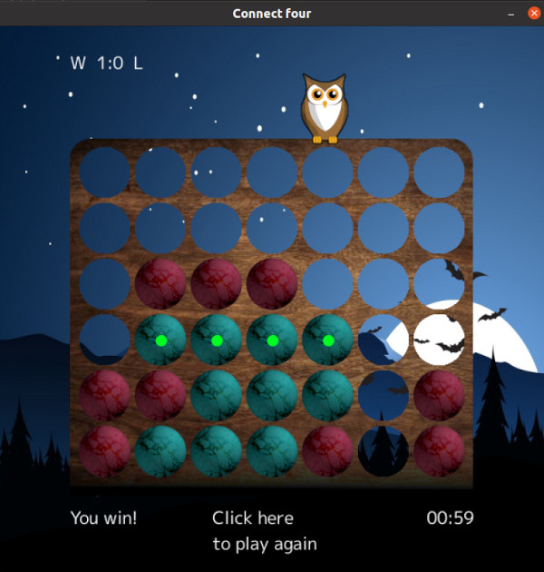

# Connect four multiplayer server
This is an implementation of the [Connect four](https://en.wikipedia.org/wiki/Connect_Four) game, made for the "Introduction to Go" course at FMI. There is a server, a client with both GUI and terminal input, and you can play against a friend or AI. For the GUI I have used the [Ebiten](https://github.com/hajimehoshi/ebiten) game engine.

There are two modes of online play:  
* Play with a friend. This works by creating a room, for which a unique token(5 character code) is generated. Other player can connect to the room with this token.  
* Quick play: You wait for a random player to connect and play with you.  

The server can handle many concurrent games as each game is in its own goroutine. It is implemented with TCP Sockets. 
You can also play against an AI which is implemented by the alpha-beta game tree search algorithm.  

Screenshot:  



To play the game
``` 
First install dependencies for Ebiten
sudo apt install libc6-dev libglu1-mesa-dev libgl1-mesa-dev libxcursor-dev libxi-dev libxinerama-dev libxrandr-dev libxxf86vm-dev libasound2-dev pkg-config

git clone https://github.com/TeodorDyakov/spooky-connect4

cd spooky-connect4/client
go run main.go

